# G-Hog-mapper-notebook

## Planning

Our initial idea is to create a remote-controlled robot that can direct live-video feed back to the controller. We want to drive this robot through the groundhog tunnels at CHS and explore the intriquite designs within. We plan to achieve this by controlling motors using a joystick, and some form of screen/camera to see video.  

Our end goal is to get video inside of the tunnels, but really just create a robot that we can cotrol and will give us live video feed. Our success will be measured by whether or not we can accomplish this goal.

## Initial brainstorming 

https://learn.adafruit.com/ttl-serial-camera/overview

https://learn.adafruit.com/adafruit-2-8-and-3-2-color-tft-touchscreen-breakout-v2

Sample drawings of our chassis
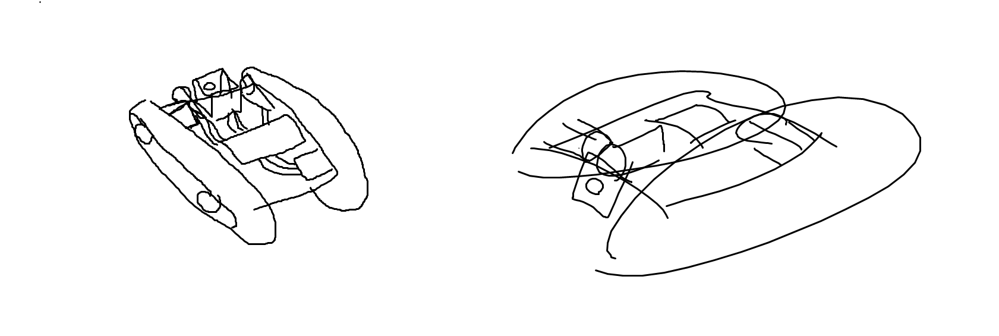

## Materials

 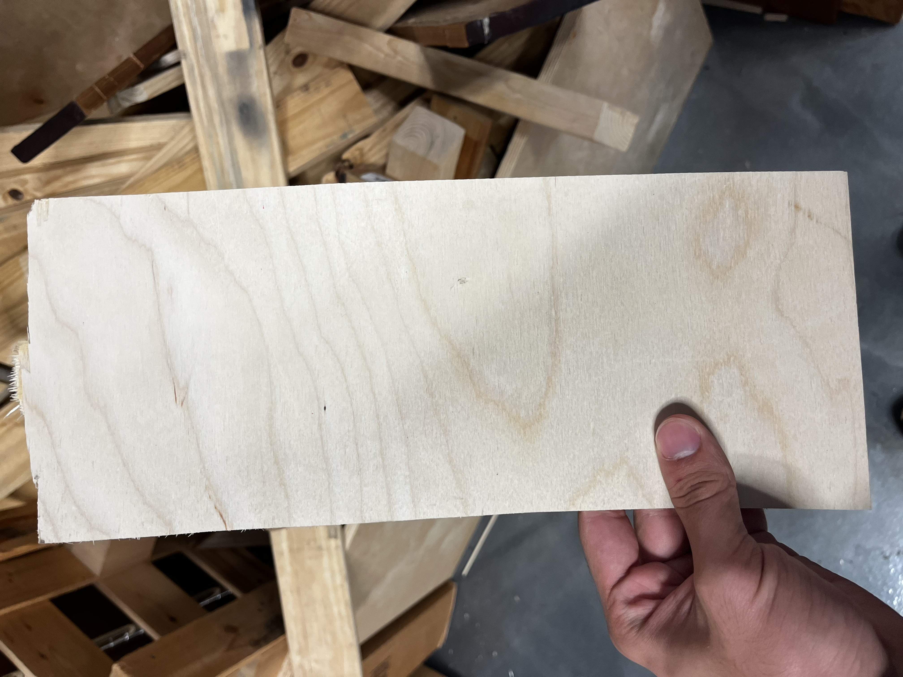

# November

### Diagram drawn by Miller for utilizing the high torque motors / H-bridge (DRV8833)
This diagram shows us how to wire the 2 potential motors we may utilize and it assists us in coding the motors.

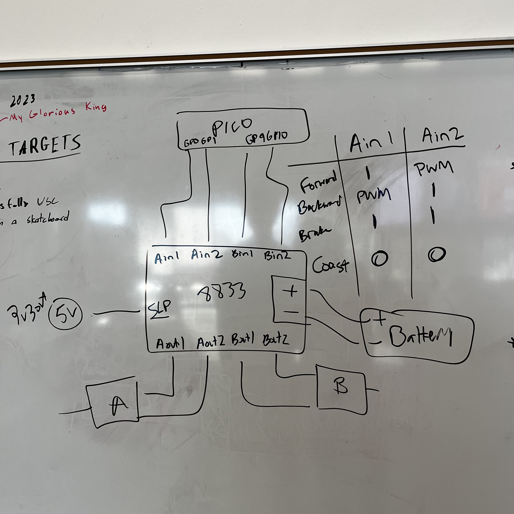

### Figured out code to move high-torque motors back and forth. Currently working on a method to move the motors independently of each other and the computer (Joystick, switch, etc.)

Had to workshop the code using other code in order to be able to use the motors to move back and forth / left and right.

Here we have the motors moving with example papers wheels.

[Joystick Code](Code/joystick.py)

### Wiring diagram for the joystick 

(Motor A is connected to AOUT 1 (power) and AOUT 2 (ground) / Motor B is connected to BOUT 1 (power) and BOUT 2 (ground)

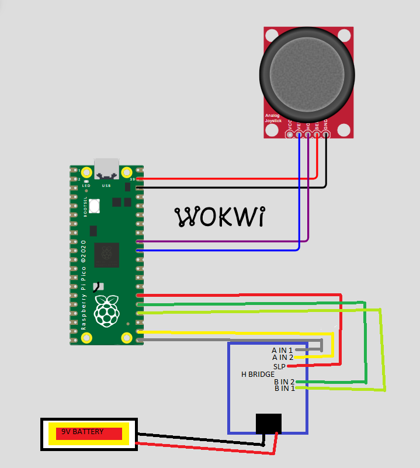

# December

### We have found a camera in the lab and have ordered this LCD screen to hopefully pair the two (99% sure this is the right one)

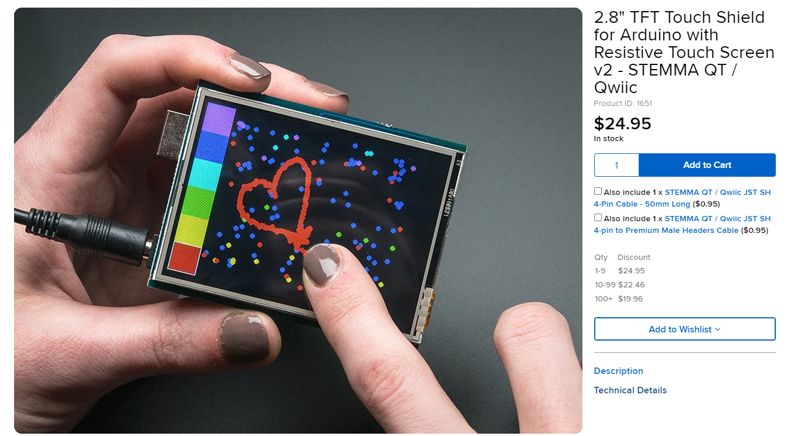

We have decided to use a LoRa board with an extra pico to be able to control the motors wirelessly. We also would like to connect the camera/screen wirelessly with the boards. We have no LoRa experience and may be difficult to pursue for our purpose

We have began to write code for the LoRa boards and tried to make them talk to one another. 

We researched the LoRa boards and brainstormed with our mentors in-person on how to move forward in our project. We have realized that we cannot transmit video from one LoRa board to another, but we will still try to see if they are feasable to transmit the signal for the joystick/motors. 

# January 

We made a lot of progress in terms of CAD, creating most of what we need for the final robot. 

### Initial Chassis Base - - - - - - - - - - - - - - - - - -Initial Rough Tread Design
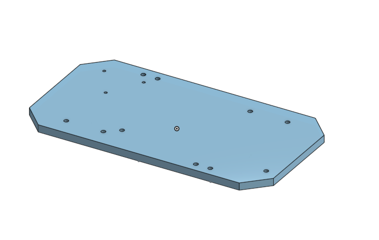                                  

### Singular Tread - - - - - - - - - - - - - - - - - - - -Tread Wheel 
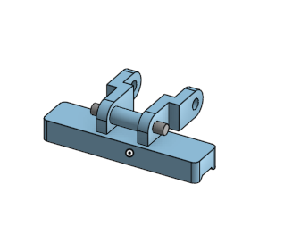 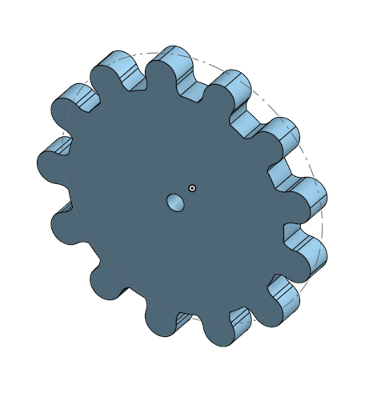

### Bracket - - - - - - - - - - - - - - - - - - - - - -Motor Bracket
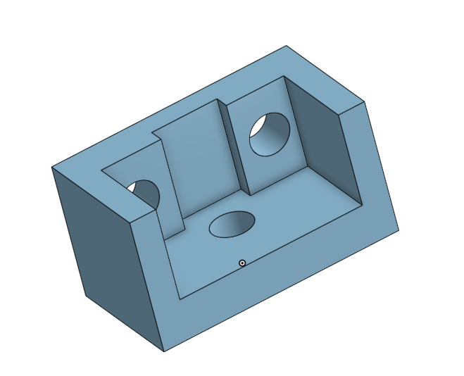 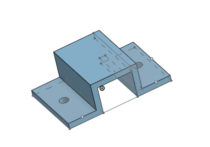

### Tread Assembly - - - - - - - - - - - - - - - - -Rough Assembly
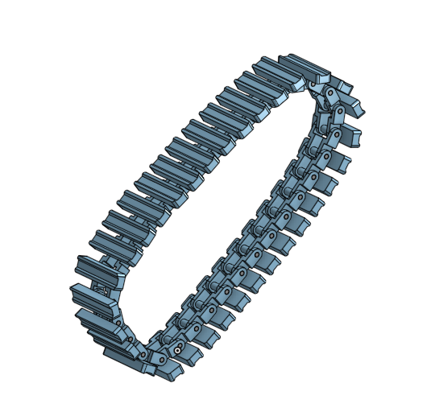 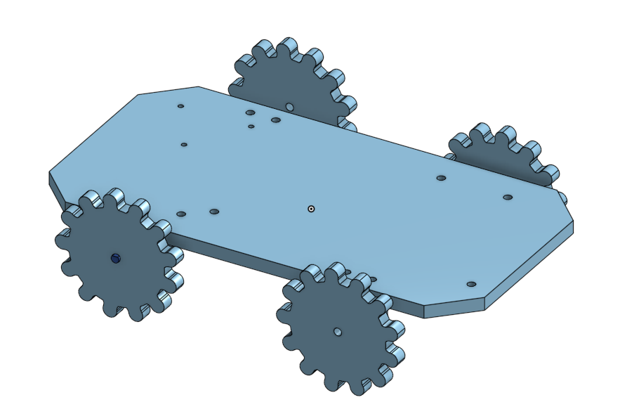

# February 

We started printing treads for the robot and researching the camera/LCD screen.

### This week the French people were here in Charlottesville. We got minimal work done during this time.

Mentors came this week. We got feedback from several UVA students and finalized our idea to fully wire the robot. We also got started on wiring and coding the LCD screen and were directed to focus on that before the camera. 

### We ordered 50 feet of wire in a cable that splits off into 8 different wires in order to allow us to use the robot at large distances. 

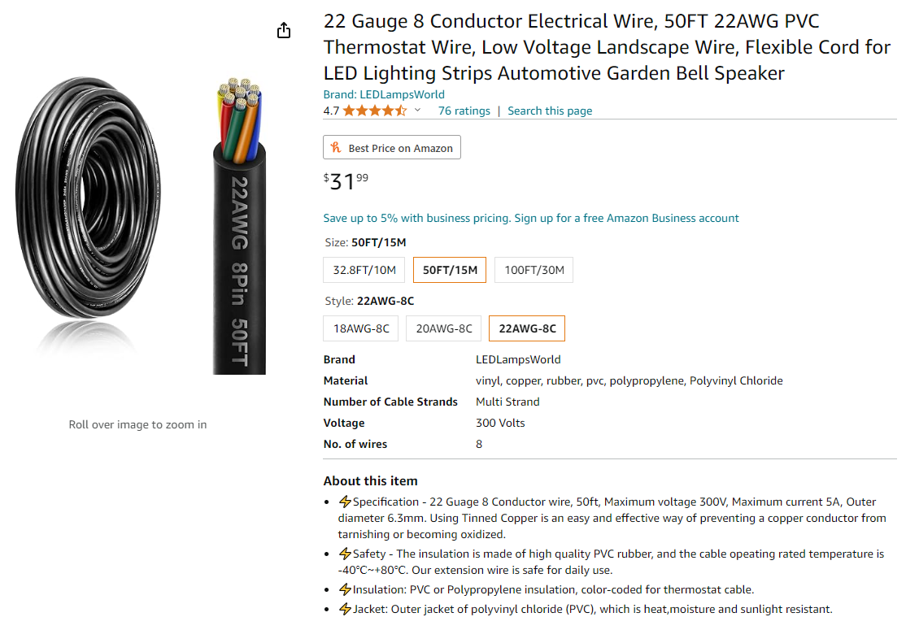

We got the LCD screen to turn on with basic code and continued to print treads and wheels for the robot.

We have created the tank treads in onshape, as well as focused on wiring/coding the camera. 

Decided to scrap LoRa and just fully wire the robot. Wires shown on the diagram are an accurate estimation of how many we will truly need. However, we are not 100% sure of how many the LCD screen will require.

# March

### Updated wiring diagram concerning the joystick control

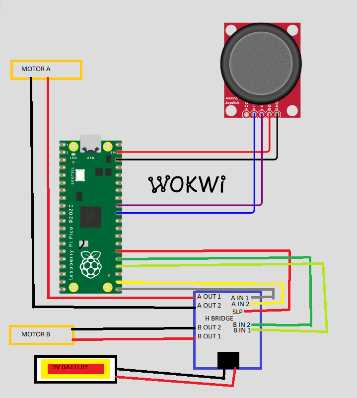

### Graham has started to create the circuit board for the robot 

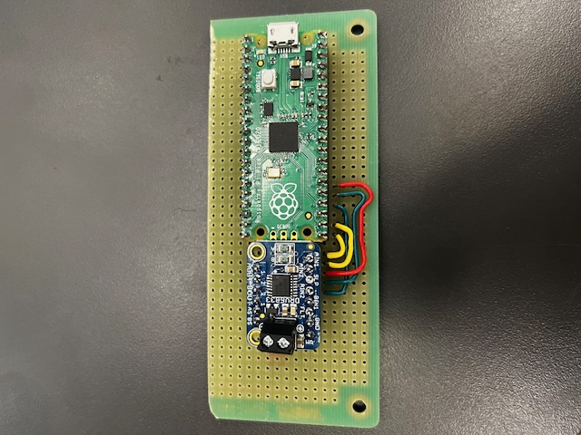

### Circuit board with battery and one of the motors attached to the laser-cut chassis
Motor is screwed into the laser-cut chassis with printed handles

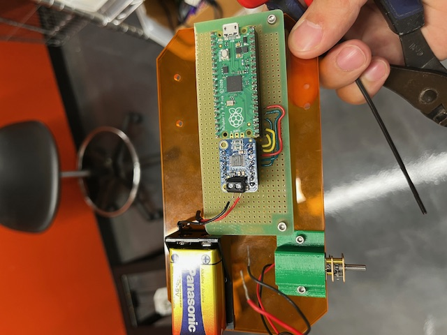

# April

Currently testing a different LCD screen that we found in the lab which acts as a shield on a metro express board, struggling to figure out the code. We have decided to forget about the LCD screen / Camera and complete the project as just a remote-controlled robot. 

### Treads are fully printed and work with both motors to move the chassis in either direction and can rotate. 

The robot is fully functional now, minus the camera

### Video of our robot doing such

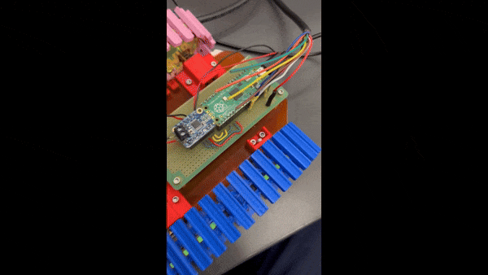

# May

### Graham's mom luckily found a cheap endoscope in the Amazon return bins
After this discovery, we are 100% able to have live video feed on the controller, which allows us to use the robot when the pilot cannot see it.

After a close inspection of the endoscope, we determined that we could use a few of the remaining wires in the 50-foot cable, and splice some of the endoscope camera wires in order to extend its range. To our surprise, this was a success and the long distance of wire had little effect on video interference. Unfortunately, however, there was one wire too few to connect the camera's flashlight.

### Last week of the year

After presenting, out robot stopped working. After working with Mr. Miller and the voltmeters, we discovered that the H-bridge for the motors was fried. We determined this by testing the voltage of each part of our project and noticing that the A out / B out pins on the H-bridge were not recieving power. We replaced the H-bridge and it now works, independent of the computer. 

### Videos of the robot moving back and forth / rotating left/right 
Video appears grainy due to frame rate of gifs

 

### Final images of our robot put together

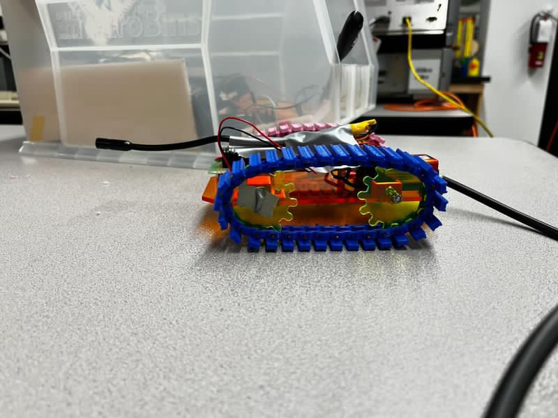 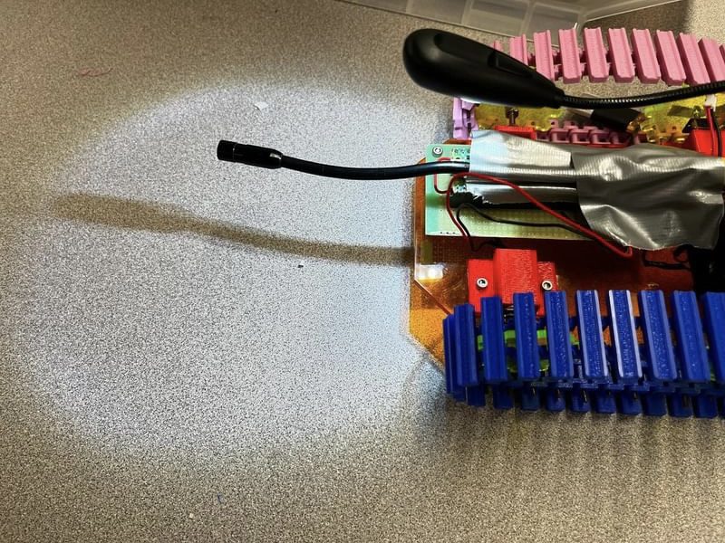
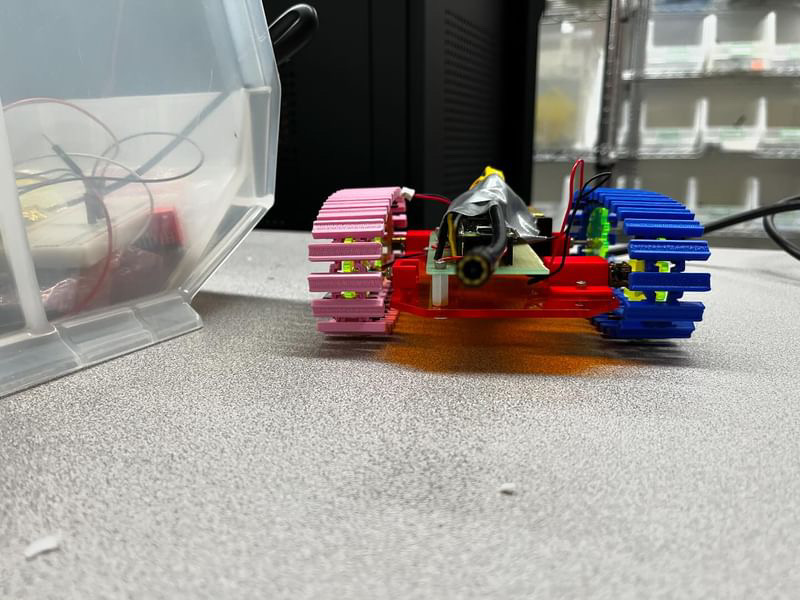 
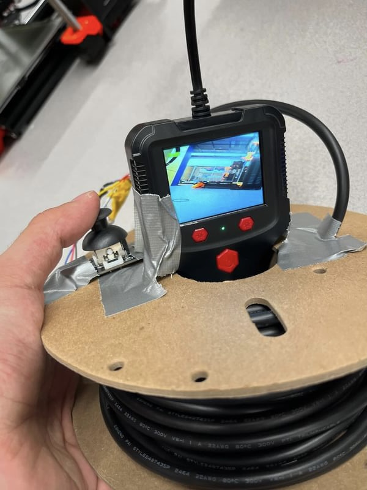 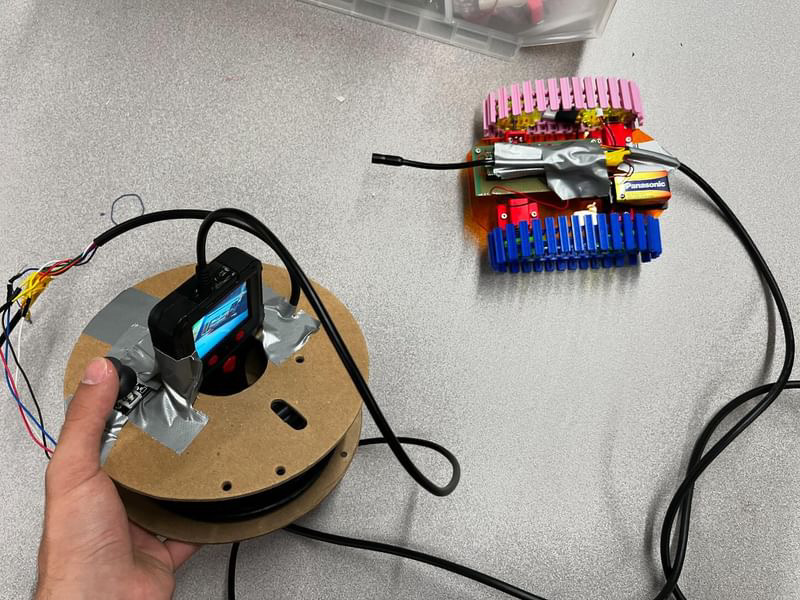 

### Testing our robot inside at a distance

