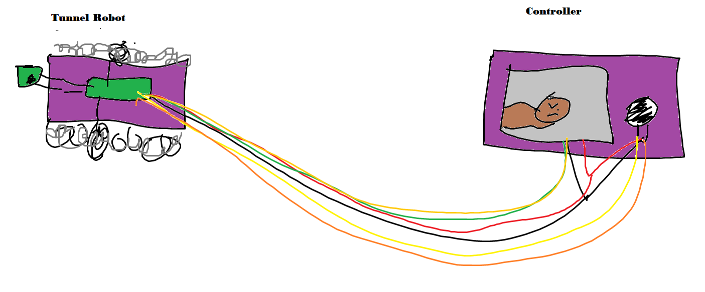

# G-Hog-mapper-notebook

# Planning

## Initial brainstorming

https://learn.adafruit.com/ttl-serial-camera/overview

https://learn.adafruit.com/adafruit-2-8-and-3-2-color-tft-touchscreen-breakout-v2

## Materials

# November

# December

# January 

# February 

# March

# April

# May

# 11/2/23

Diagram drawn by Miller for utilizing the high torque motors / H-bridge (DRV8833)

# 11/9/23 Review

### What did you work on?
Figured out code to move high-torque motors back and forth. Currently working on a method to move the motors independently of each other and the computer (Joystick, switch, etc.)

### What decisions were made?
We decided we would use the 2 high torque motors controlled by a joystick or 2.

### What new resources did you find?
We found the joysticks which can be used as controls for the motors.

### What new issues were discovered?
We discovered that we would need to workshop code based on code in other languages.

### What went well?
We have already generated some code for the joysticks reading the values.

#### What was difficult?
Figuring out the method to indepentently move the motors.

### What is your plan for next week?
The plan is to get the joysticks to move the motors.

# 11/28/23

### What did we accomplish?

Code now allows for us to control the motors Forwards/Backwards and turning Left/Right.

# 12/1/23 Review

### What did you work on?
Code now allows for us to control the motors Forwards/Backwards and turning Left/Right using the joystick.

### What decisions were made?
We have decided to use a LoRa board with an extra pico to be able to control the motors wirelessly.

### What new resources did you find?
LoRa board, LCD screen.

### What new issues were discovered?
How does a LoRa board work?

### What went well?
Coding the joystick/motors together.

### What was difficult?
Time.

### What is your plan for next week?
Working on the LoRa board.

# 12/8/23 Review

### What did you work on?
We researched the LoRa boards and brainstormed with our mentors on how to move forward with them.

### What decisions were made?
We realized we cannot use LoRa to transmit video so it will have to be a wired connection. 

### What new resources did you find?
We found the LoRa boards and wires online.

### What new issues were discovered?
LoRa will not transmit video or anything that requires more than 50kb/s.

### What went well?
Our in-person meeting with our mentors went well.

### What was difficult?
Attempting to figure out how the LoRa boards work has been difficult. 

### What is your plan for next week?
Get the Pico boards talking to each other via LoRa and do more research about how to efficiently connect the two with a wired connection.

# 12/15/23 Review

### What did you work on?
We began to wire the LoRa boards and began writing code to make the boards talk to each other.

### What decisions were made?
We decided we will use treads to move the vehicle and have finalized the decision to wire the boards together.

### What new resources did you find?
Circuit python forums depicting code for the LoRa boards.

### What new issues were discovered?
The LoRa board is complicated and requires more time than expected to understand the intricacies. 

### What went well?
We established a clear path for completing the LoRa section of our project.

### What was difficult?
It was difficult attempting to connect the LoRa boards via code.

### What is your plan for next week?
Get the boards to talk to each other.

# 2/9/24

We started printing treads for the robot and researching the camera/LCD screen.

# 2/16/24

This week the French people were here in Charlottesville. We got minimal work done during this time.

# 2/23/24

Mentors came this week. We got feedback from several UVA students and finalized our idea to fully wire the robot. We also got started on wiring and coding the LCD screen and were directed to focus on that before the camera.

# 2/29/24

We got the LCD screen to turn on with basic code and continued to print treads and wheels for the robot.

### What we have worked on

We have created the tank treads in onshape, as well as focused on wiring/coding the camera. 

Decided to scrap LoRa and just fully wire it. Wires shown on the diagram are an accurate estimation of how many we will truly need. However we are not 100% sure of how many the LCD screen will require.

# April

Currently testing the LCD screen as a shield on a metro express board, struggling to figure out the code

Updated wiring diagram concerning the joystick control

